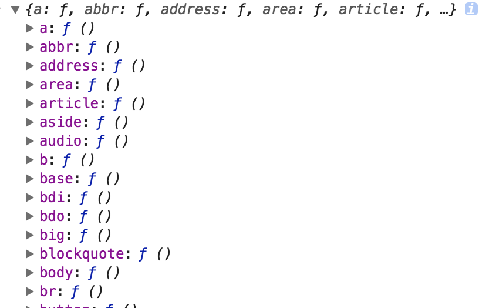

#### 1.学会使用findDOMNode(this)与React.DOM[element]
```js
import hljs from 'highlight.js';
import React from 'react';
import ReactDOM from 'react-dom';

class Highlight extends React.Component {
    componentDidMount() {
        this.highlightCode();
    }
    componentDidUpdate() {
        this.highlightCode();
    }
    highlightCode() {
        const domNode = ReactDOM.findDOMNode(this);
        //(1)获取该组件挂载的所有的DOM节点而不是虚拟DOM，挂载的方式是将this.props.children放到特定的标签里面完成挂载，同时用户可以指定挂载的元素的标签类型
        const nodes = domNode.querySelectorAll('pre code');
        let i;
        for (i = 0; i < nodes.length; i++) {
            hljs.highlightBlock(nodes[i]);
        }
    }
    render() {
        const {children, className, element, innerHTML} = this.props;
        let Element = element ? React.DOM[element] : null;
        //(2)用户指定了特定的标签类型，将this.props.children挂载到该类型的标签上并返回
        if (innerHTML) {
           //(3)Enable to render markup with dangerouslySetInnerHTML!如果允许使用dangerouslySetInnerHTML方法
           //如果没有指定标签那么使用div即可
            if (!Element) {
                Element = React.DOM.div
            }
            //将children作为dangerouslySetInnerHTML插入进去
            return Element({dangerouslySetInnerHTML: {__html: children}, className: className || null}, null);
        } else {
            if (Element) {
                //(4)如果指定了放置到特定的元素里面，那么我们手动创建这个元素(通过React.DOM可以获取创建特定标签的函数)，然后将children放进去
                return Element({className}, children);
            } else {
                //(5)如果没有指定特定的元素，那么久直接返回一个pre+code标签，同时将children放到这个code标签里面
                return <pre><code className={className}>{children}</code></pre>;
            }
        }
    }
}
Highlight.defaultProps = {
    innerHTML: false,
    className: null,
    element: null,
};
export default Highlight;
```
组件并不是真实的 DOM 节点，而是存在于内存之中的一种数据结构，叫做虚拟 DOM （virtual DOM）。只有当它插入文档以后，才会变成真实的 DOM 。根据 React 的设计，所有的 DOM 变动，都先在虚拟 DOM 上发生，然后再将实际发生变动的部分，反映在真实 DOM上，这种算法叫做 DOM diff ，它可以极大提高网页的性能表现。
但是，有时需要从组件获取真实 DOM 的节点，这时就要用到 React.findDOMNode 方法。基础信息你可以[点击这里](https://www.kancloud.cn/kancloud/react/67582)，该例子给出了[通过ref来获取到真实的用户输入](../react-ref/index.md)。上面的代码片段来自于[react-highlight](https://github.com/akiran/react-highlight/blob/master/src/index.js)的源码，通过这个源码很容易就知道，通过findDOM(this)可以获取到当前组件所有挂载的真实DOM节点，然后进行高亮显示。而React.DOM[element]可以获取到React构建特定标签的构造函数，如下图:



我们给出一个简单的例子:
```js
class Demo extends React.Component{
       render(){
         return (
           <div>demo<\/div>
         ) 
       }
     }
 class Test extends React.Component{
   componentDidMount(){
      const reactDOM = ReactDOM.findDOMNode(this);
      console.log('reactDOM',reactDOM);
   }
   render(){
     const reactDOM = ReactDOM.findDOMNode(this);
     console.log('reactDOM',reactDOM);
     return (
        <div>
         <Demo/>
         <h1>Hello, world!</h1>
         <span></span>
       <\/div>
     )
   }
 }
  ReactDOM.render(
   <Test\/>,
    document.getElementById('example')
  );
```
此时你会发现在render方法中reactDOM为undefined，而在componentDidMount中获取到的是这个组件的真实DOM。此时内容如下:
```html
<div data-reactroot="">
  <div>demo</div>
  <h1>Hello, world!</h1>
  <span></span>
</div>
```
即reactDOM是将该组件所有的子组件都渲染为真实的DOM以后得到的nativeDOM对象。此时，你可以通过调用querySelectorAll来继续获取DOMNode的子元素，因为React中最外层不能有平级的元素，所以此处相当于调用含有data-reactroot属性的元素的native方法。


参考资料：

[七、React.findDOMNode()](https://www.kancloud.cn/kancloud/react/67582)

[React 集成 highlight](http://me.lizhooh.com/2017/09/01/React/React/React%20%E9%9B%86%E6%88%90%20highlight/)
